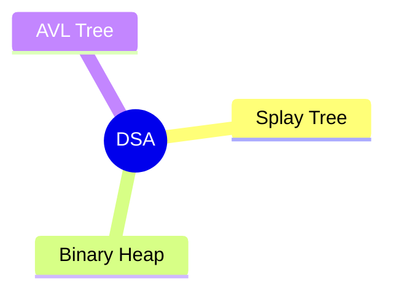
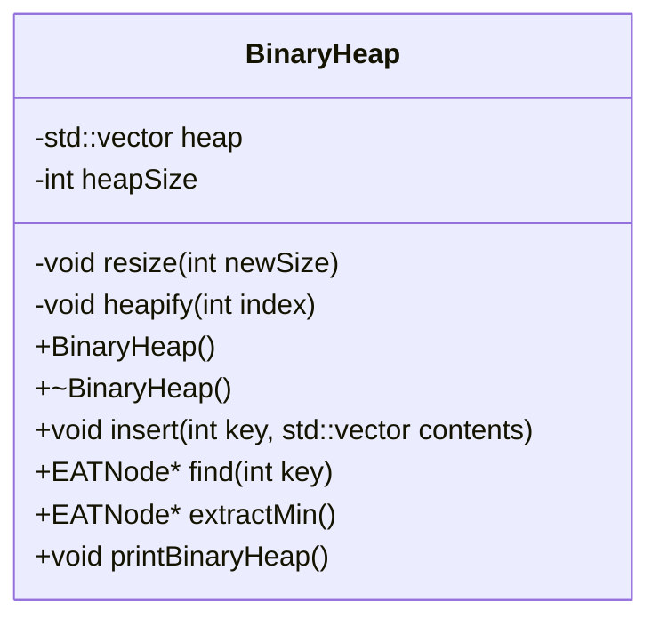
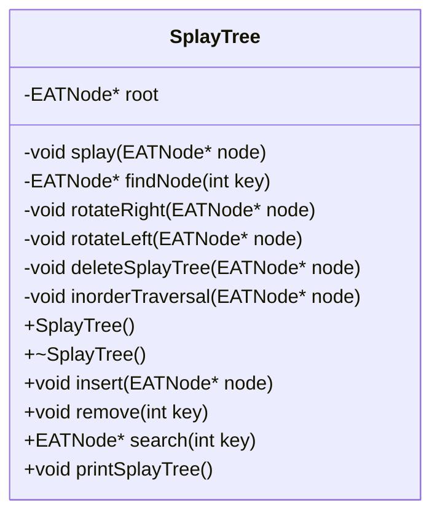

# Data Structures and Algorithms in Use

For the Edstem-Lesson-Tracker project we use the following data structures and algorithms:

## Descriptions and Explanations 

### Binary Heap

**Description**
A Binary Heap is a self balancing data structure that acts very similarly to a priority queue with binary search tree qualities

<!--change these later-->

---
### Splay Tree

---
### AVL Tree

